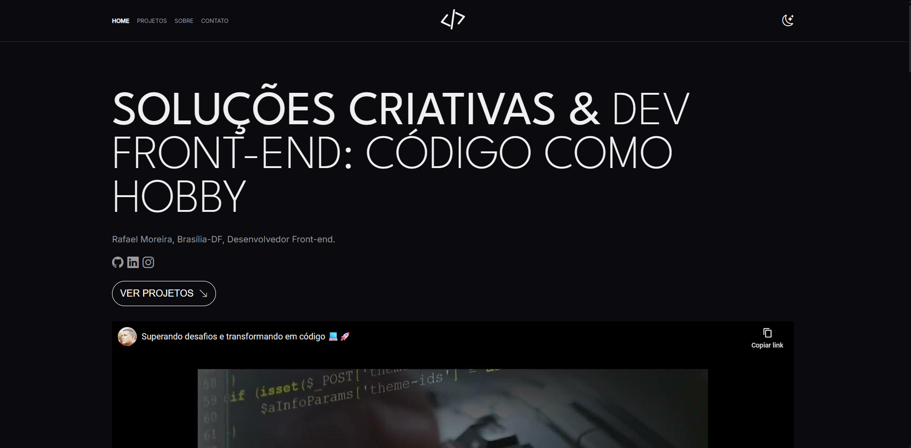

# 💼 Desafio: Portfólio Front-end
A proposta foi criar um **portfólio autêntico e responsivo**, permitindo personalização através do arquivo `data.json`, sem necessidade de alterar o HTML manualmente. 

# 🎯 Deploy do Desafio
🔗 [Clique aqui para acessar a página](https://portfolio-frontend-dio.netlify.app/)



# 🗂️ Estrutura do Projeto
```
📁 assets
┣ 📁 css
┃ ┗ 📄 styles.css
┣ 📁 images
┃ ┣ 📁 projects
┃ ┣ 📁 technologies
┃ ┗ 📄 perfil.png
📁 data
┃ ┗ 📄 data.json
📁 js
┃ ┣ 📄 api.js
┃ ┣ 📄 main.js
┃ ┗ 📄 scripts.js
📄 index.html
📄 README.md
```
# 🖥️ Tecnologias Utilizadas
[]()
[]() 
[]() 

## 🔗 Links de Referência
- [Plataforma DIO](https://web.dio.me/)  
- [Deploy Netlify](https://portfolio-frontend-dio.netlify.app/)  

## 👨‍💻 Autor
- Desenvolvido por [Rafael Moreira](https://github.com/RafaeltiMoreira)  
